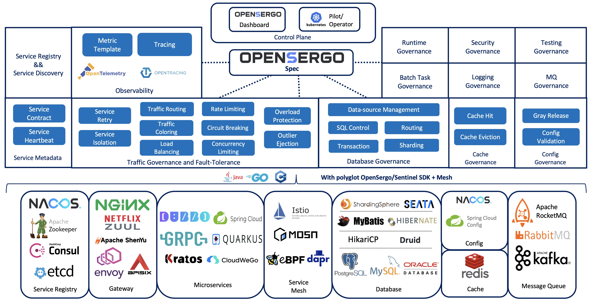

# [OpenSergo Specification](./specification/en/README.md)

[中文说明](./README.zh-Hans.md)

## Overview

OpenSergo is an open, language-agnostic cloud-native service governance specification that is close to business semantics.
In the scenario of heterogeneous microservices system, enterprises can manage services in different languages and protocols with this unified specification.

## Projects

* [opensergo-specification](https://github.com/opensergo/opensergo-specification): defines the OpenSergo specification
* [opensergo-control-plane](https://github.com/opensergo/opensergo-control-plane): OpenSergo control plane enables unified management for microservice governance rules with OpenSergo CRD.
* [opensergo-proto](https://github.com/opensergo/opensergo-proto): the OpenSergo Universal Transport Service protocol that defines the conmunication between the client and control plane.
* [opensergo-java-sdk](https://github.com/opensergo/opensergo-java-sdk): the Java SDK that implements the OpenSergo specification
* [opensergo-go-sdk](https://github.com/opensergo/opensergo-go-sdk): the Go SDK that implements the OpenSergo specification
* [opensergo-dashboard](https://github.com/opensergo/opensergo-dashboard): the unified dashboard to managing the heterogeneous microservices.

## Community

### Bi-weekly meeting

* APAC Friendly Community meeting: Bi-weekly APAC (Starting Apr 27th, 2022), Wednesday 19:30-20:30 GMT+8
* Meeting minutes: [OpenSergo Bi-weekly Meeting Minutes](https://github.com/opensergo/opensergo-specification/issues/7)
* Meeting recordings: OpenSergo bilibili Channel

### Contact

* [DingTalk Group](https://page.dingtalk.com/wow/dingtalk/act/en-home): `34826335`

* WeChat Group

OpenSergo official WeChat account (微信公众号): OpenSergo

Broker wechat account to add you into the user group:

