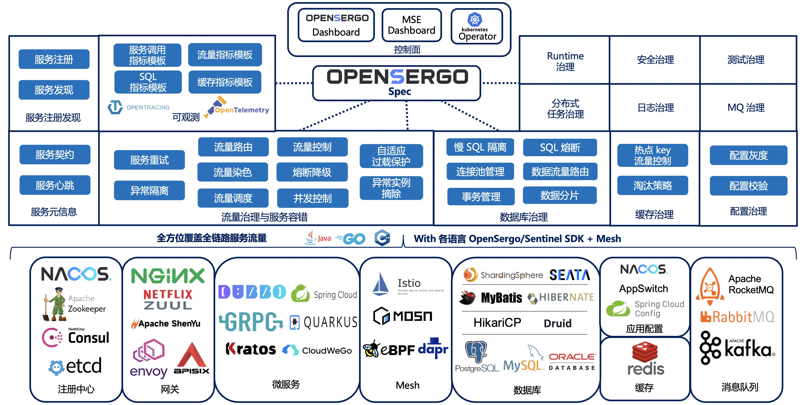

# [OpenSergo 标准规范](./specification/zh-Hans/README.md)

[English](./README.md)

OpenSergo 是一套开放、通用的、面向分布式服务架构、覆盖全链路异构化生态的服务治理标准，基于业界服务治理场景与实践形成通用标准规范。OpenSergo 的最大特点就是**以统一的一套配置/DSL/协议定义服务治理规则，面向多语言异构化架构，做到全链路生态覆盖**。无论微服务的语言是 Java, Go, Node.js 还是其它语言，无论是标准微服务还是 Mesh 接入，从网关到微服务，从数据库到缓存，从服务注册发现到配置，开发者都可以通过同一套 OpenSergo CRD 标准配置针对每一层进行统一的治理管控，而无需关注各框架、语言的差异点，降低异构化、全链路服务治理管控的复杂度。

## 社区

[钉钉群](https://www.dingtalk.com/): `34826335`

微信群（添加微信账号并回复OpenSergo，会你拉进群）：

