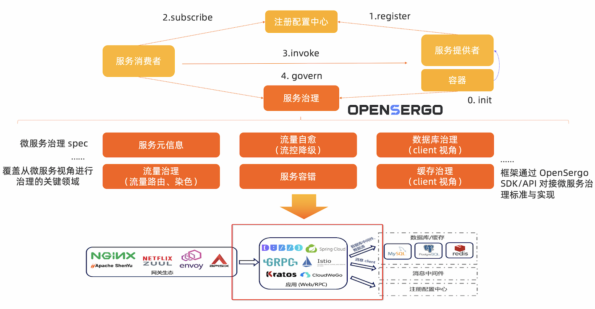

# [OpenSergo 微服务治理标准](./specification/zh-Hans/README.md)

[English](./README.md)

## 概述

OpenSergo 是开放通用的，覆盖微服务及上下游关联组件的微服务治理项目。OpenSergo 从微服务的角度出发，涵盖**流量治理、服务容错、服务元信息治理、安全治理**等关键治理领域，提供一系列的治理能力与标准、生态适配与最佳实践，支持 Java, Go, Rust 等多语言生态。OpenSergo 项目由阿里巴巴、bilibili、中国移动、SphereEx 等企业，以及 Kratos、CloudWeGo、ShardingSphere、Database Mesh、Spring Cloud Alibaba、Apache Dubbo 等社区联合发起，共同主导治理标准建设与能力演进。

OpenSergo 的最大特点就是**以统一的一套配置/DSL/协议定义服务治理规则，面向多语言异构化架构，做到全链路生态覆盖**。无论微服务的语言是 Java, Go, Node.js 还是其它语言，无论是标准微服务还是 Mesh 接入，从网关到微服务，从数据库到缓存，从服务注册发现到配置，开发者都可以通过同一套 OpenSergo CRD 标准配置针对每一层进行统一的治理管控，而无需关注各框架、语言的差异点，降低异构化、全链路服务治理管控的复杂度。

OpenSergo 官方网站：http://opensergo.io/zh-cn/

## 项目

* [opensergo-specification](https://github.com/opensergo/opensergo-specification): Spec 以统一的一套配置/DSL 定义微服务治理规则与配置，确保开发者可以用同一套标准对不同框架、不同协议、不同语言的微服务架构进行统一治理管控。
* [opensergo-control-plane](https://github.com/opensergo/opensergo-control-plane): OpenSergo 提供 Control Plane（控制平面）作为 OpenSergo CRD 的统一管控组件，承载配置转换与下发的职责。
* OpenSergo SDK: OpenSergo 多语言 SDK 提供统一的 OpenSergo 适配层，供各个开源框架/组件接入到 OpenSergo 生态中。目前社区已提供 Java SDK 和 Go SDK。
  * [opensergo-java-sdk](https://github.com/opensergo/opensergo-java-sdk)
  * [opensergo-go-sdk](https://github.com/opensergo/opensergo-go-sdk)
* [opensergo-proto](https://github.com/opensergo/opensergo-proto): 定义客户端和控制平面之间的通信协议定义。
* [opensergo-dashboard](https://github.com/opensergo/opensergo-dashboard): OpenSergo 控制台。

## 社区
### 社区双会议

OpenSergo 社区会议每两周开展一次（一般是在周三晚，GMT+8），时间为1小时左右，议程如下：

* 同步上一周期的进展，包括 spec 建设、Control Plane/SDK 建设、框架生态接入等进展，回顾下社区的 Issue/PR 等
* 同步下一周期的规划和方向
* 社区分享

社区会议最新安排可参考[此处](https://github.com/opensergo/opensergo-specification/issues/7)。社区会议记录可见 [GitHub Discussions](https://github.com/opensergo/opensergo-specification/discussions)。

### 社区交流方式

- [OpenSergo 钉钉交流群](https://www.dingtalk.com/)：34826335

- 微信公众号与微信群

OpenSergo 官方微信公众号：OpenSergo

微信群（添加微信账号并回复 OpenSergo，会你拉进群）：

