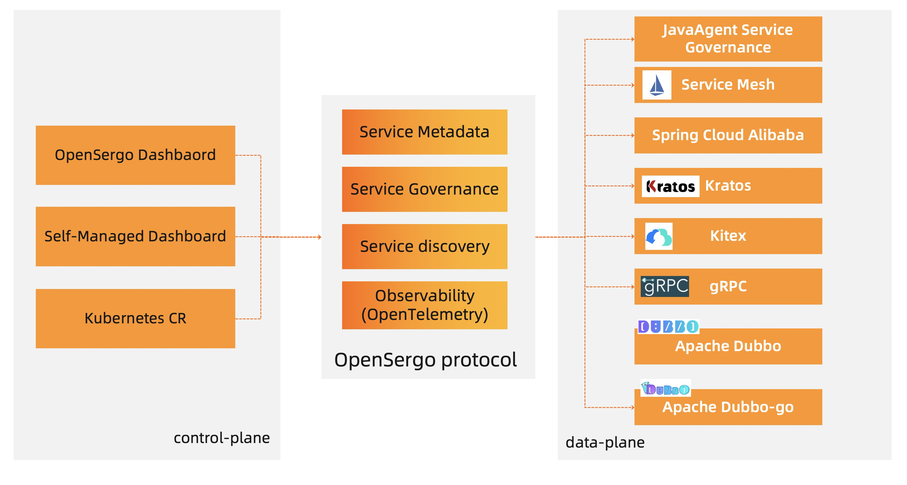

# OpenSergo Specification

OpenSergo is an open, language-agnostic, and cloud-native service governance specification that is close to business semantics.
In the scenario of heterogeneous microservice system, enterprises can manage services in different languages and protocols with this unified specification. 

## Status

0.0.1: The specification is in continuous iteration and is not recommended for production at this time.

Protocol versions evolve according to [semantic version 2.0](https://semver.org/spec/v2.0.0.html).

## Glossary

* Application - Represents a microservice, typically standalone deployed, that may provide one or more services for the provider to invoke.
* Service - A collection of interfaces with explicit business semantics that can be invoked by consumers, usually containing one or more interfaces.
* Interface - Used to represent an identified interface, usually with an explicit interface description, call parameter definition, and return value definition.
* Node - Indicates the hardware resource where an application is deployed. Multiple nodes can form a cluster.
* Cluster - A cluster defines a group of nodes where an application is deployed, for example, a K8S cluster. A group of virtual machines can also form a cluster.
* Environment - The combination of a set of resources on which an application is deployed and run. Common environment definitions include test, daily, staging, and production. An environment can contain multiple clusters.
* Tag - An application can be composed of multiple nodes. The nodes of the same application can be divided into different groups according to their functions. The nodes that meet certain conditions can be selected through tags.

## Background

Micro-services frameworks with different language, different communication protocol,  has a different abstraction for their own ability and the model. For example, some framework use interface level service registration and discovery, some framework use  application level service registration and discovery. As a result, it is difficult to connect and manage heterogeneous microservice systems in a unified management system.

`OpenSergo`  try to solve this problem by standardizing concepts, defining microservice components, service registration discovery, service metadata format, service observability and other basic capabilities to open up the application of various microservice frameworks. At the same time, through protocol standardization, the communication protocol between data plane and control plane is clarified, and the standard format of service governance rules is determined, so as to realize unified governance of heterogeneous microservice system.

## Scope of OpenSergo

* Service registration discovery: Define service registration and discovery capabilities between services so that heterogeneous microservices can be interconnected.
* Service governance: Define service meta-information formats and service governance specific capabilities, describing the effects these capabilities are intended to achieve.
* Service observability: Define the data format of service observability to lay a foundation for distributed tracing, service governance capability visualization, and etc.

## Architecture of OpenSergo



Introduction to modules:

* Control plane (responsible for receiving reported metadata and delivering service governance rules) : End users can view and modify service governance configurations through either the dashboard or through the kubernates CRD.
* Data plane (responsible for receiving and applying service governance configuration) : generally refers to various microservice frameworks, which can be divided into three main forms: SDK, Java Agent and Sidecar.
* Communication protocol: OpenSergo protocol is used to communicate between the control plane and data plane.

## OpenSergo protocol

The OpenSergo protocol consists of the following parts:

* Service registration and discovery protocol: Define the service registration and discovery communication protocol between services, so that heterogeneous microservices can be interconnected.
* Service metadata protocol: For services, service contract information needs to be reported for service debugging, service routing and other service governance scenarios, as well as heartbeat information to ensure the timeliness of service metadata.
* Service governance rule protocol: defines how service governance rules are delivered and how the data plane listens to service governance configuration information.
* Service Observability protocol (OpenTelemetry) : defines the data format of service observability, laying a foundation for distributed tracing, service governance capability visualization, and etc.

### communication protocol

The gRPC protocol is used to report service information, deliver configuration, and listener services.

### Service Metadata protocol

Service metadata reported through ` opensergo. API. V1. MetadataService. ReportMetadata ` method. The input type is `ReportMetadataRequest`, the output type is `ReportMetadataReply`.

Service contract information is defined in 'protobuf' format [service_contract.proto](https://github.com/opensergo/opensergo-proto/blob/main/opensergo/proto/service_contract/v1/service_contract.proto#L26).

#### ReportMetadataRequest

*Field number 1-32 are reserved for future expansion of the OpenSergo protocol*

| Field number | Field name | Type | Optional | Description |
| -------- | -------- | -------- |  ---- | ---- |
| 1     |   app_name   |  string    |  required | name of application |
| 2     |   node   |   Node   |  required | infomation of the node |
| 3     |   service_metadata   |   ServiceMetadata array   |  required | service metadata of application |

#### ReportMetadataReply

*Field number 1-32 are reserved for future expansion of the OpenSergo protocol*

Currently ReportMetadataReply does not have any field.

#### ServiceMetadata

*Field number 1-32 are reserved for future expansion of the OpenSergo protocol*

| Field number | Field name | Type | Optional | Description |
| -------- | -------- | -------- |  ---- | ---- |
| 1     |   listening_addresses   |  SocketAddress array    |  required | listening address of service |
| 2     |   protocols   |  string array    |  required | supported communication protocols |
| 3     |   service_contract   |  ServiceContract    |  required |  service contract |

#### Notation of communication protocol

In order to clearly express the access mode supported by the service, the overall service access mode is represented by `<communication-protocol>://<ip>:<port>`.

Currently, reserved communication protocols include `http`, `dubbo`, `tri`, `grpc`, and `thrift`.

#### ServiceContract

*Field number 1-32 are reserved for future expansion of the OpenSergo protocol*

| Field number | Field name | Type | Optional | Description |
| -------- | -------- | -------- |  ---- | ---- |
| 1     |   services   |  ServiceDescriptor array    |  required | Included service definitions |
| 2     |   types   |  TypeDescriptor array    |  required | message type definitions used by services |

#### ServiceDescriptor

*Field number 1-32 are reserved for future expansion of the OpenSergo protocol*

| Field number | Field name | Type | Optional | Description |
| -------- | -------- | -------- |  ---- | ---- |
| 1     |   name   |  string    |  required | service name, must be unique in the application |
| 2     |   methods   |  MethodDescriptor array |    |  required | the method definitions provided by the service |
| 3     |   description  |  string    |  optional | service Description |

#### MethodDescriptor

*Field number 1-32 are reserved for future expansion of the OpenSergo protocol*

| Field number | Field name | Type | Optional | Description |
| -------- | -------- | -------- |  ---- | ---- |
| 1     |   name   |  string    |  required | method name, must be unique in the service |
| 2     |   input_types   |  string array    |  required | The input type name of the method, the type definition can be found in Servicecontract.types |
| 3     |   output_types   |  string array    |  required | The type name of the method's output argument can be found in servicecontract.types |
| 5     |   client_streaming  |  bool    |  optional | Identifies if client streams multiple client messages |
| 6     |   server_streaming  |  bool    |  optional | Identifies if server streams multiple server messages |
| 7     |   description  |  string    |  optional | description of method |
| 8     |   http_paths  |  string array    |  optional | paths of http |
| 9     |   http_methods  |  string array   |  optional | methos of http |

#### TypeDescriptor

*Field number 1-32 are reserved for future expansion of the OpenSergo protocol*

| Field number | Field name | Type | Optional | Description |
| -------- | -------- | -------- |  ---- | ---- |
| 1     |   name   |  string    |  required | type name, must be unique in ServiceContract |
|2 | fields | FieldDescriptor array | required | definitions of fields |


#### FieldDescriptor

*Field number 1-32 are reserved for future expansion of the OpenSergo protocol*

| Field number | Field name | Type | Optional | Description |
| -------- | -------- | -------- |  ---- | ---- |
| 1     |   name   |  string    |  required | field name, must be unique in the type |
|3 | number | int32 | required | field number of the field, used for serialization |
|5| type| FieldDescriptor.Type | required | type of field |
|6| type_name | string | optional | when type is TYPE_MESSAGE, type_name is message name |
|7|description|string|optional| description of field |


#### FieldDescriptor.Type

*Field number 1-256 are reserved for future expansion of the OpenSergo protocol*

This type is enum, and represents the type of the field.

| Field number | Field name | Description |
| -------- | -------- | ---- |
|0|TYPE_UNSPECIFIED| default value, indicating that no type is specified|
|1|TYPE_DOUBLE| double|
|2|    TYPE_FLOAT| float|
|3|TYPE_INT64  | int64|
|4| TYPE_UINT64 | uint64|
|5|TYPE_INT32| int32 |
|6| TYPE_FIXED64 | fixed64 |
|7|    TYPE_FIXED32 |fixed32 |
|8| TYPE_BOOL | bool |
|9|  TYPE_STRING | string |
|11|    TYPE_MESSAGE |message, custom compound type |
|12|TYPE_BYTES | bytes |
|13|TYPE_UINT32| uint32 |
|14|TYPE_ENUM | enum |
|15|TYPE_SFIXED32 | sfixed32 |
|16|TYPE_SFIXED64 | sfixed64 |
|17|TYPE_SINT32 | sint32 |
|18|TYPE_SINT64 | sint64 |

#### Node

*Field number 1-32 are reserved for future expansion of the OpenSergo protocol*

| Field number | Field name | Type | Optional | Description |
| -------- | -------- | -------- |  ---- | ---- |
| 1     |   identifier   |  NodeIdentifier    |  required | identify the node |
| 4     |   locality   |  Locality    |  optional | identify the region where a node deployed |
| 5     |   tag   |  string    |  optional | service tag of a node |
| 6     |   cluster   |  string    |  optional | cluster where the node deployed |
| 7     |   env   |  string    |  optional | environment where the node deployed |

#### NodeIdentifier

*Field number 1-32 are reserved for future expansion of the OpenSergo protocol*

| Field number | Field name | Type | Optional | Description |
| -------- | -------- | -------- |  ---- | ---- |
| 1     |   host_name   |  string    |  required | hostname of machine/pod |
| 2     |   pid|uint32   |    required | process id |
| 3     |   start_timestamp|google.protobuf.Timestamp   |    required | start time of the process, the process ID may be reused |

#### SocketAddress

*Field number 1-32 are reserved for future expansion of the OpenSergo protocol*

| Field number | Field name | Type | Optional | Description |
| -------- | -------- | -------- |  ---- | ---- |
| 1     |   address   |  string    |  required | IP address of the listener, must be IP addresses that are visible outside the machine. 0.0.0.0 and 127.0.0.1 cannot be accessed externally |
| 2     |   port_value|uint32   |    required | port number |

#### Locality

*Field number 1-32 are reserved for future expansion of the OpenSergo protocol*

| Field number | Field name | Type | Optional | Description |
| -------- | -------- | -------- |  ---- | ---- |
| 2     |   region   |  string    |  required | region where the node is deployed |
|3|zone|string|required| zone where the node is deployed |

### Service governance rule protocol

The defination of service governance rule.

TBD

## Data-plane and control-plane communication configuration

For the microservice framework connected to OpenSergo, the data-plane needs to communicate with the control plane to report metadata, pull data from the control-plane, and watch service governance configurations. The convention data-plane must access the control-plane using environment variables.

The following two environment variables are used:

1. key is`OPENSERGO_BOOTSTRAP_CONFIG`，
  value is JSON format of service governance access infomation:

  ```json
  {
    "endpoint":"opensergo-pilot.opensergo-pilot.svc.cluster.local:50051"
  }
  ```

2. key is`OPENSERGO_BOOTSTRAP`, value indicates the path of the configuration file. The path points to the service governance configuration file in JSON format.

For the microservice framework, if either of the preceding two environment variables exists, enable the service governance function and establish a connection with the control-plane according to the OpenSergo protocol.

## Appendix

[reference depoyment](../zh-Hans/reference-depoyment.md)

## Credit

* This specification is inspired by envoyproxy/data-plane-api, and [rsocket broker specification](https://github.com/rsocket-broker/rsocket-broker-spec).
* This specification is inspired by protobuf format.
