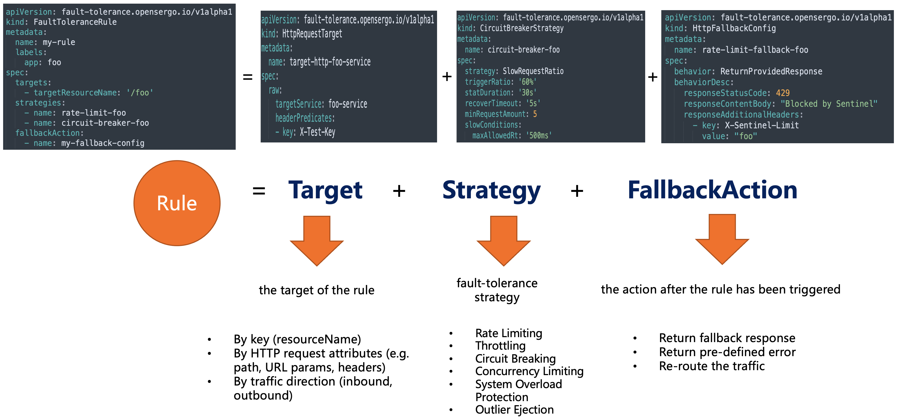

# Fault-tolerance spec v1alpha1

* domain: fault-tolerance
* version: v1alpha1



## FaultToleranceRule

`FaultToleranceRule` YAML sample: 

```yaml
apiVersion: fault-tolerance.opensergo.io/v1alpha1
kind: RateLimitStrategy
metadata:
  name: rate-limit-foo
spec:
  metricType: RequestAmount
  limitMode: Global
  threshold: 10
  statDuration: "1s"
---
apiVersion: fault-tolerance.opensergo.io/v1alpha1
kind: HttpRequestFallbackAction
metadata:
  name: fallback-foo
spec:
  behavior: ReturnProvidedResponse
  behaviorDesc:
    responseStatusCode: 429
    responseContentBody: "Blocked by Sentinel"
    responseAdditionalHeaders:
      - key: X-Sentinel-Limit
        value: "foo"
---
apiVersion: fault-tolerance.opensergo.io/v1alpha1
kind: FaultToleranceRule
metadata:
  name: my-rule
  namespace: prod
  labels:
    app: my-app
spec:
  selector:
    app: my-app
  targets:
    - targetResourceName: '/foo'
  strategies: 
    - name: rate-limit-foo
  fallbackAction: fallback-foo
```