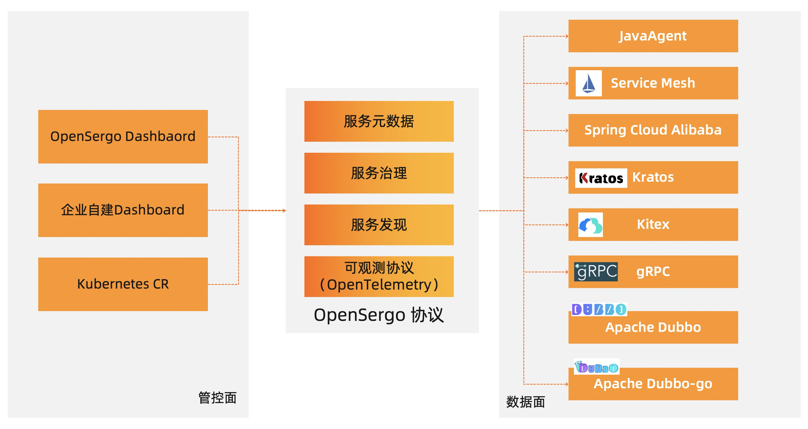

# OpenSergo Spec

OpenSergo 是一套开放的、语言无关的、贴近业务语义的云原生服务治理规范。面向异构微服务体系的场景，让企业能够以一种统一的规范来管理不同语言、不同协议的服务。

## 当前的状态

0.0.1: 规范尚在持续迭代中，当前不建议用于生产。

协议版本按照[语义化版本 2.0](https://semver.org/lang/zh-CN/spec/v2.0.0.html)进行演进。

## 术语表

* 应用（Application）- 用于表示一个微服务，通常以独立形态部署，可能提供一个或多个服务供提供者调用。
* 服务（Service）-   带有明确业务语义的一组接口的集合，供消费者进行调用，通常包含一个或多个接口。
* 接口（Interface）- 用于表示一个确定的接口，通常有明确的接口描述，调用的参数定义，及返回值定义。
* 节点（Node）- 表示应用部署所在的具体硬件资源，多个节点可以构成一个集群。
* 集群（Cluster）- 集群定义了应用部署所在的一组节点的集合，例如一个 k8s 集群，一组虚拟机也可以构成一个集群。
* 环境（Environment）- 应用部署及运行所在的一系列资源的组合，常用的环境定义包括测试，日常，预发布，生产。一个环境可以包括多个集群。
* 标签 （Tag）- 一个应用可以有多个节点组成，同一个应用下的节点可以按照功能划分成不同分组，通过标签来筛选出满足一定条件的节点集合。

## 背景

不同语言、不同协议的开发的微服务框架，对于各自的能力和模型都有不同的抽象，例如有的微服务框架是接口级别进行服务注册和发现，有的微服务框架是通过应用级别进行注册和发现，造成对异构微服务系统间互联互通，并且进行统一的治理变得非常困难。`OpenSergo` 试图解决这个问题，通过概念标准化，定义微服务组件，服务注册发现，服务元信息格式，服务可观测等基础能力，打通各个微服务框架构建的应用；同时通过协议标准化，明确数据面和控制面通信方式、确定服务治理规则的标准格式，实现异构微服务系统的统一治理。

## OpenSergo的范围

* 服务注册发现：定义服务之间的服务注册和发现能力，使得异构微服务体系可以互联互通。
* 服务治理：定义服务元信息格式，以及服务治理具体能力，描述这些能力所要达到的效果。
* 服务可观测性：定义服务可观测性的数据格式，为链路追踪，服务治理能力可视化等做好基础。

## OpenSergo的架构



各模块介绍

* 控制面（负责接收上报的元数据，下发服务治理规则）：最终用户通过管控端来查看、修改服务治理配置
* 数据面（负责接收并应用服务治理配置）：一般是指各个微服务框架，主要形态可以分为三类，SDK、Java Agent、Sidecar。
* 通信协议：控制面和数据面之间，通过 OpenSergo 协议来通信。

## OpenSergo 协议

OpenSergo 协议主要包含以下几个部分：

* 服务注册和发现协议：定义服务之间的服务注册和发现通讯协议，使得异构微服务体系可以互联互通。
* 服务元数据协议：对于服务而言，需要上报服务契约信息，用于进行服务调试，服务路由等服务治理场景，以及心跳信息，用于确保服务元数据的时效性。
* 服务治理规则协议：定义服务治理规则如何下发、数据面如何监听服务治理的配置信息。
* 服务可观测协议（OpenTelemetry）：定义服务可观测性的数据格式，为链路追踪，服务治理能力可视化等做好基础。

### 通信协议

服务信息的上报和配置的下发、监听都基于 gRPC 协议来实现。

### 服务元数据协议

服务元数据的上报通过`opensergo.api.v1.MetadataService.ReportMetadata`方法上报实现，入参为`ReportMetadataRequest`，出参为`ReportMetadataReply`。

具体的服务契约信息以 `protobuf` 格式定义 [service_contract.proto](https://github.com/opensergo/opensergo-proto/blob/main/opensergo/proto/service_contract/v1/service_contract.proto#L26)。

#### 服务元数据请求/ReportMetadataRequest

*字段id 1-32为OpenSergo协议预留，供未来扩展*

| 字段id | 字段名 | 类型 | 必选/可选 | 描述 |
| -------- | -------- | -------- |  ---- | ---- |
| 1     |   app_name   |  string    |  必选 | 唯一应用名字 |
| 2     |   node   |   Node   |  必选 | 该节点的信息 |
| 3     |   service_metadata   |   ServiceMetadata   |  必选 | 服务元信息 |

#### 服务元数据响应/ReportMetadataReply

*字段id 1-32为OpenSergo协议预留，供未来扩展*

目前ReportMetadataReply没有任何字段

#### 服务元信息/ServiceMetadata

*字段id 1-32为OpenSergo协议预留，供未来扩展*

| 字段id | 字段名 | 类型 | 必选/可选 | 描述 |
| -------- | -------- | -------- |  ---- | ---- |
| 1     |   listening_addresses   |  SocketAddress数组    |  必选 | 服务监听的地址 |
| 2     |   protocols   |  string数组    |  必选 | 服务支持的通信协议 ，见[通信协议表示](#通信协议表示)|
| 3     |   service_contract   |  ServiceContract    |  必选 |  服务契约信息 |

#### 通信协议的表示法

为了能够清晰的表示服务支持的访问方式，整体的服务访问方式采用`<通信协议>://<ip>:<port>`表示。
目前约定的通信协议包括 `http`、`dubbo`、`tri`、`grpc`、`thrift` 。

#### 服务信息/ServiceContract

*字段id 1-32为OpenSergo协议预留，供未来扩展*

| 字段id | 字段名 | 类型 | 必选/可选 | 描述 |
| -------- | -------- | -------- |  ---- | ---- |
| 1     |   services   |  ServiceDescriptor数组    |  必选 | 包含的服务定义 |
| 2     |   types   |  TypeDescriptor数组    |  必选 | 包含服务使用到的消息类型定义 |

#### 服务定义信息/ServiceDescriptor

*字段id 1-32为OpenSergo协议预留，供未来扩展*

| 字段id | 字段名 | 类型 | 必选/可选 | 描述 |
| -------- | -------- | -------- |  ---- | ---- |
| 1     |   name   |  string    |  必选 | 服务名字，在应用中唯一 |
| 2     |   methods   |  MethodDescriptor数组    |  必选 | 包含服务提供的方法定义 |
| 3     |   description  |  string    |  可选 | 包含服务的业务描述信息 |

#### 方法定义信息/MethodDescriptor

*字段id 1-32为OpenSergo协议预留，供未来扩展*

| 字段id | 字段名 | 类型 | 必选/可选 | 描述 |
| -------- | -------- | -------- |  ---- | ---- |
| 1     |   name   |  string    |  必选 | 方法名字，在服务中唯一 |
| 2     |   input_types   |  string数组    |  必选 | 方法的入参类型名，可以在ServiceContract.types中找到类型定义 |
| 3     |   output_types   |  string数组    |  必选 | 方法的出参类型名，可以在ServiceContract.types中找到类型定义 |
| 5     |   client_streaming  |  bool    |  可选 | 客户端是否流式发送数据 |
| 6     |   server_streaming  |  bool    |  可选 | 服务端是否流式发送数据 |
| 7     |   description  |  string    |  可选 | 方法的业务描述 |
| 8     |   http_paths  |  string数组    |  可选 | 表示http方法的path |
| 9     |   http_methods  |  string数组   |  可选 | 支持的http请求方法 |

#### 类型定义信息/TypeDescriptor

*字段id 1-32为OpenSergo协议预留，供未来扩展*

| 字段id | 字段名 | 类型 | 必选/可选 | 描述 |
| -------- | -------- | -------- |  ---- | ---- |
| 1     |   name   |  string    |  必选 | 类型名字，在整个服务契约中必须唯一 |
|2 | fields | FieldDescriptor数组 | 必选 | 各个字段的定义 |


#### 字段定义信息/FieldDescriptor

*字段id 1-32为OpenSergo协议预留，供未来扩展*

| 字段id | 字段名 | 类型 | 必选/可选 | 描述 |
| -------- | -------- | -------- |  ---- | ---- |
| 1     |   name   |  string    |  必选 | 字段名字，在当前类型中必须唯一 |
|3 | number | int32 | 必选 | 当前字段的字段id，序列化时使用 |
|5| type| FieldDescriptor.Type | 必选 | 当前字段的类型 |
|6| type_name | string | 可选 | 当字段类型是 TYPE_MESSAGE 时，表示类型的全名 |
|7|description|string|可选|字段的描述信息|

#### 字段类型/FieldDescriptor.Type

*字段id 1-256为OpenSergo协议预留，供未来扩展*

此类型为枚举，表示字段的类型。随着接入rpc框架的扩展，类型会扩充。


| 字段id | 字段名 |  描述 |
| -------- | -------- | ---- |
|0|TYPE_UNSPECIFIED| 默认值，表示没有指定类型|
|1|TYPE_DOUBLE| double类型|
|2|    TYPE_FLOAT| float类型|
|3|TYPE_INT64  | int64类型|
|4| TYPE_UINT64 | uint64类型|
|5|TYPE_INT32|int32类型|
|6| TYPE_FIXED64 | fixed64类型|
|7|    TYPE_FIXED32 |fixed32类型|
|8| TYPE_BOOL | bool 类型|
|9|  TYPE_STRING | string类型|
|11|    TYPE_MESSAGE |message类型，表示是自定义的复合类型|
|12|TYPE_BYTES |bytes类型，表示字节数组|
|13|TYPE_UINT32| uint32类型 |
|14|TYPE_ENUM | 枚举类型|
|15|TYPE_SFIXED32 | sfixed32类型，32位定长数值|
|16|TYPE_SFIXED64 | sfixed64类型，64位定长数值|
|17|TYPE_SINT32 | sint32类型 |
|18|TYPE_SINT64 | sint64类型 |

#### 节点信息/Node

*字段id 1-32为OpenSergo协议预留，供未来扩展*

| 字段id | 字段名 | 类型 | 必选/可选 | 描述 |
| -------- | -------- | -------- |  ---- | ---- |
| 1     |   identifier   |  NodeIdentifier    |  必选 | 节点和进程的唯一定位标志 |
| 4     |   locality   |  Locality    |  可选 | 标志节点的所在区域信息 |
| 5     |   tag   |  string    |  可选 | 节点的业务标签 |
| 6     |   cluster   |  string    |  可选 | 节点所在的集群 |
| 7     |   env   |  string    |  可选 | 节点所在的环境 |

#### 节点标识信息/NodeIdentifier

*字段id 1-32为OpenSergo协议预留，供未来扩展*

| 字段id | 字段名 | 类型 | 必选/可选 | 描述 |
| -------- | -------- | -------- |  ---- | ---- |
| 1     |   host_name   |  string    |  必选 | 节点所在的主机名 |
| 2     |   pid|uint32   |    必选 | 进程id |
| 3     |   start_timestamp|google.protobuf.Timestamp   |    必选 | 进程启动的时间，因为进程id有可能会重用，所以需要加上进程启动时间来唯一标识 |

#### 监听地址信息/SocketAddress

*字段id 1-32为OpenSergo协议预留，供未来扩展*

| 字段id | 字段名 | 类型 | 必选/可选 | 描述 |
| -------- | -------- | -------- |  ---- | ---- |
| 1     |   address   |  string    |  必选 | 监听的ip地址。必须使用机器外可见的ip地址，0.0.0.0和127.0.0.1不能被外部访问 |
| 2     |   port_value|uint32   |    必选 | 监听的端口号 |

#### 节点位置信息/Locality

*字段id 1-32为OpenSergo协议预留，供未来扩展*

| 字段id | 字段名 | 类型 | 必选/可选 | 描述 |
| -------- | -------- | -------- |  ---- | ---- |
| 2     |   region   |  string    |  必选 | 节点所部署的region |
|3|zone|string|必选|节点所部署的可用区|

### 服务治理规则协议

服务治理规则的定义

TBD

## 数据面和控制面通信配置

对于接入 OpenSergo 的微服务框架，作为数据面，需要和控制面进行通信，将元数据进行上报、以及从控制面拉取、监听服务治理配置。约定数据面**必须**使用环境变量方式接入控制面。

规定如下两个环境变量：

1. key 为`OPENSERGO_BOOTSTRAP_CONFIG`，
  value 为 JSON 格式的服务治理配置内容，比如：

  ```json
  {
    "endpoint":"opensergo-pilot.opensergo-pilot.svc.cluster.local:50051"
  }
  ```

2. key 为`OPENSERGO_BOOTSTRAP`，value为配置文件路径，路径指向的文件内容是 JSON 格式的服务治理配置。

对于微服务框架，如果上述两个环境变量任意一个存在，则开启服务治理功能，按照OpenSergo协议与控制面建立连接。

## 附录

[参考部署模式](./reference-depoyment.md)

## 致谢

* 本规范参考了 envoyproxy/data-plane-api 、rsocket 的定义。
* 本规范参考了 protobuf 的定义。
