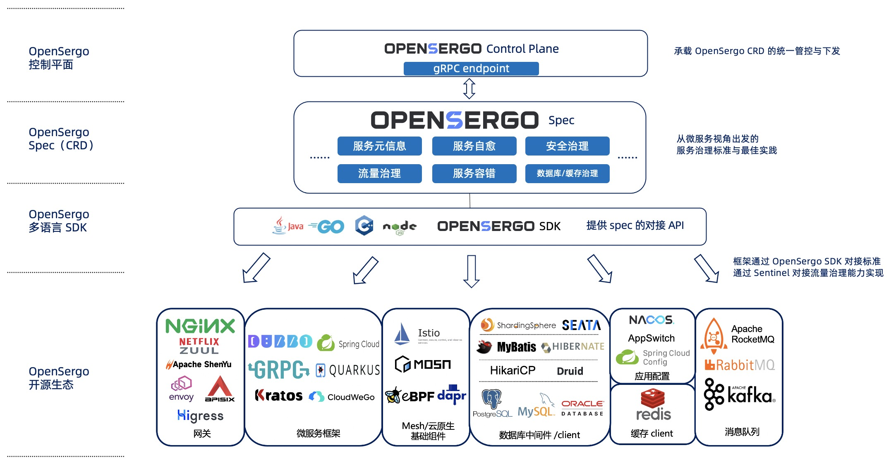

# OpenSergo Spec

[OpenSergo 官方文档](https://opensergo.io/zh-cn/docs/what-is-opensergo/intro/)

OpenSergo 是一套开放通用的、语言无关的、面向云原生的微服务治理标准。OpenSergo 从微服务的角度出发，涵盖流量治理、服务容错、服务元信息治理、安全治理等关键治理领域，提供一系列的治理能力与标准、生态适配与最佳实践。

OpenSergo 的最大特点就是以统一的一套配置/DSL/协议定义服务治理规则，面向多语言异构化架构，覆盖微服务框架及上下游关联组件。

## 术语表

### 基础术语

* 应用（Application）：用于表示一个微服务，通常以独立形态部署，可能提供一个或多个服务供提供者调用。
* 服务（Service）：带有明确业务语义的一组接口的集合，供消费者进行调用，通常包含一个或多个接口。
* 接口（Interface）：用于表示一个确定的接口，通常有明确的接口描述，调用的参数定义，及返回值定义。
* 工作负载（Workload）：表示某个部署集合，如 Kubernetes Deployment, Statefulset 或者一组 pod，或某个业务进程，甚至是一组 DB 实例
* 节点（Node）：表示应用部署所在的具体硬件资源，多个节点可以构成一个集群。
* 集群（Cluster）：集群定义了应用部署所在的一组节点的集合，例如一个 K8s 集群，一组虚拟机也可以构成一个集群。
* 环境（Environment）：应用部署及运行所在的一系列资源的组合，常用的环境定义包括测试，日常，预发布，生产。一个环境可以包括多个集群。
* 标签（Tag）：一个应用可以有多个节点组成，同一个应用下的节点可以按照功能划分成不同分组，通过标签来筛选出满足一定条件的节点集合。

### 治理能力术语

* 微服务治理：微服务治理就是通过流量治理、服务容错、安全治理等技术手段来减少甚至避免发布和管理大规模应用过程中遇到的稳定性问题，对微服务领域中的各个组件进行治理。
* 流量路由：将具有某些属性特征的流量，路由到指定的目标 workload。
* 流量染色：将具有某些属性特征的流量进行标记，并且将标记跟随着链路一直传递下去。
* 流量防护：通过流量控制、熔断降级等手段，从流量与服务调用关联的维度，保障服务运行时的稳定性与连续性。
* 服务容错与自愈：通过重试防抖、熔断等手段，保障服务在出现异常时可快速止损与恢复。
* 数据库治理：从微服务访问数据库的视角进行治理，包括读写流量治理、数据分片、数据流量隔离、数据加解密等能力。
* 缓存治理：从微服务访问缓存的视角进行治理，如热点 key 防击穿等。

## OpenSergo 项目结构

* [**OpenSergo Spec**](https://github.com/opensergo/opensergo-specification)：Spec 以统一的一套配置/DSL 定义微服务治理规则与配置，确保开发者可以用同一套标准对不同框架、不同协议、不同语言的微服务架构进行统一治理管控。
* **OpenSergo SDK**：OpenSergo 多语言 SDK 提供统一的 OpenSergo 适配层，供各个开源框架/组件接入到 OpenSergo 生态中。目前社区已提供 [Java SDK](https://github.com/opensergo/opensergo-java-sdk) 和 [Go SDK](https://github.com/opensergo/opensergo-go-sdk)。
* [**OpenSergo 控制面**](https://github.com/opensergo/opensergo-control-plane)：OpenSergo 提供 Control Plane 作为 OpenSergo CRD 的统一管控组件，承载配置转换与下发的职责。
* **数据面（各框架生态）** ：各个接入 OpenSergo 生态的微服务框架/组件，都可以通过统一的 OpenSergo CRD 进行服务治理管控。

服务信息的上报，以及 OpenSergo 规则的监听与下发都基于 gRPC 协议来实现，定义参见 [opensergo-proto](https://github.com/opensergo/opensergo-proto)。

## OpenSergo 服务治理标准

* [服务元信息](./service-metadata.md)
* 服务发现
* 流量治理，包括：
  * [流量路由](./traffic-routing.md)
  * 流量染色
  * [流量防护与容错](./fault-tolerance.md)
* [微服务视角的数据库治理](./database.md)
* 微服务视角的缓存治理
* 微服务视角的消息与事件治理
