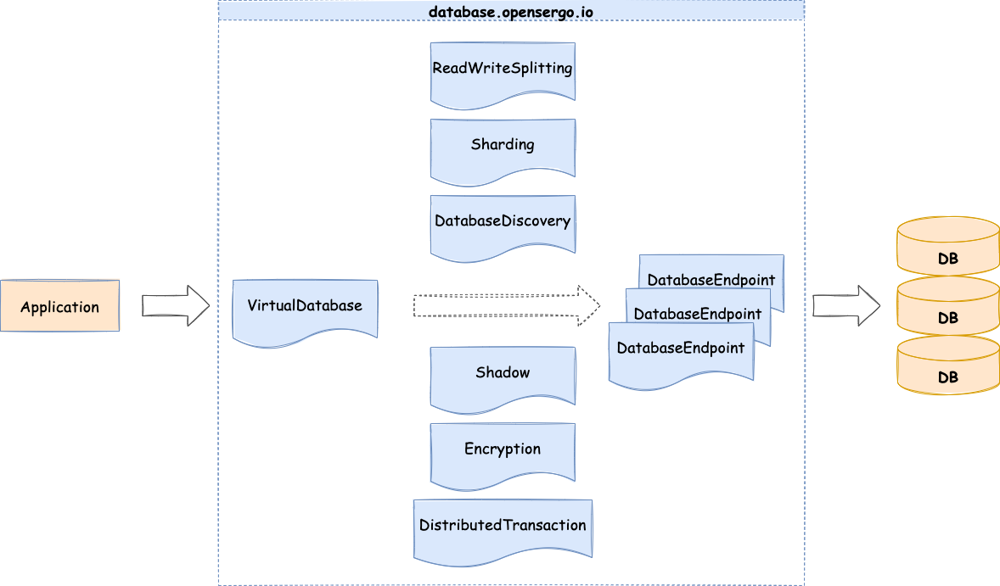

# 数据库治理标准 v1alpha1

* domain: database
* version: v1alpha1

数据库治理，指的是对微服务系统中所有涉及数据库的治理内容的总称。作为微服务中最重要的状态终端，所有的业务信息、关键数据都需要健壮稳定的数据库系统。对于数据库治理目前主要集中在

- 读写分离 [#25](https://github.com/opensergo/opensergo-specification/issues/25)
- 分库分表 [#26](https://github.com/opensergo/opensergo-specification/issues/26)
- 加密 [#28](https://github.com/opensergo/opensergo-specification/issues/28)
- 影子库 [#32](https://github.com/opensergo/opensergo-specification/issues/32)
- 数据库发现 [#38](https://github.com/opensergo/opensergo-specification/issues/38)
- 分布式事务 [#39](https://github.com/opensergo/opensergo-specification/issues/39)

几个方面。而决定应用消费数据库的方式以及实际的数据库存储节点还依赖于以下两个概念：

- 虚拟数据库 [#23](https://github.com/opensergo/opensergo-specification/issues/23)
- 数据库端点 [#24](https://github.com/opensergo/opensergo-specification/issues/24)

当声明一个虚拟数据库的时候，需要指定某种治理方式并绑定多个数据库端点后方可生效。组成形式如下：



## 虚拟数据库 VirtualDatabase

在数据库治理中，不管是读写分离、分库分表、影子库，还是加密、审计和访问控制等，都需要作用在一个具体的数据库之上。在这里将这样的一个逻辑的数据库称为虚拟数据库，即 VirtualDatabase。VirtualDatabase 在应用看来是一组特定的数据库访问信息，并通过绑定特定的治理策略实现相应的治理能力。以读写分离为例：

- services: 表示一组数据库服务。对于每个数据库服务，需要的信息有：
  - name: 当前数据库服务的名称
  - databaseMySQL: 表示当前声明一个 MySQL 协议的数据库
  - readWriteSplitting: 表示当前数据库需要的读写分离策略（可选）

一个基础的 YAML 示例：
```yaml
apiVersion: database.opensergo.io/v1alpha1
kind: VirtualDatabasemetadata:
  name: readwrite_splitting_db
spec:
  services:
  - name: readwrite_splitting_db
    databaseMySQL:
      db: readwrite_splitting_db
      host: localhost
      port: 3306
      user: root
      password: root
    readWriteSplitting: "readwrite"  # 声明所需要的读写分离策略
    sharding: "sharding_db"          # 声明所需要的分库分表策略
    encryption: "encrypt-db"         # 声明所需要的加密配置
    shadow: "shadow-db"              # 声明所需要的影子库配置
    distributedTransaction: "sharding_db_txn"       # 声明所需要的分布式事务类型
```

## 数据库端点 DatabaseEndpoint

在数据库治理中，通过 VirtualDatabase 向应用声明了可以使用的逻辑数据库，而数据的真实存储则依赖于这样的一个物理的数据库，这里称为数据库访问端点，即 DatabaseEndpoint。DatabaseEndpoint 对应用无感知，它只能被 VirtualDatabase 通过特定治理策略所绑定然后连接和使用。这里以读写分离为例：

- database: 表示一个数据库访实例，需要的信息有：
  - MySQL: 表示当前声明一个 MySQL 协议的数据库
  - connectionPool: 当前数据库实例的连接池配置（可选）

一个基础的 YAML 示例：

```yaml
apiVersion: database.opensergo.io/v1alpha1
kind: DatabaseEndpoint
metadata:
  name: write_ds
spec:
  database:
    MySQL:                 # 声明后端数据源的类型及相关信息
      url: jdbc:mysql://192.168.1.110:3306/demo_write_ds?serverTimezone=UTC&useSSL=false
      username: root
      password: root
      connectionTimeout: 30000
      idleTimeoutMilliseconds: 60000
      maxLifetimeMilliseconds: 1800000
      maxPoolSize: 50
      minPoolSize: 1
---
apiVersion: database.opensergo.io/v1alpha1
kind: DatabaseEndpoint
metadata:
  name: ds_0
spec:
  database:
    MySQL:                 # 声明后端数据源的类型及相关信息
      url: jdbc:mysql://192.168.1.110:3306/demo_read_ds_0?serverTimezone=UTC&useSSL=false
      username: root
      password: root
      connectionTimeout: 30000
      idleTimeoutMilliseconds: 60000
      maxLifetimeMilliseconds: 1800000
      maxPoolSize: 50
      minPoolSize: 1      
---
apiVersion: database.opensergo.io/v1alpha1
kind: DatabaseEndpoint
metadata:
  name: ds_1
spec:
  database:
    MySQL:                              # 声明后端数据源的类型及相关信息
      url: jdbc:mysql://192.168.1.110:3306/demo_read_ds_1?serverTimezone=UTC&useSSL=false
      username: root
      password: root
      connectionTimeout: 30000
      idleTimeoutMilliseconds: 60000
      maxLifetimeMilliseconds: 1800000
      maxPoolSize: 50
      minPoolSize: 1
```

## 读写分离 ReadWriteSplitting

读写分离是常用的数据库扩展方式之一，主库用于事务性的读写操作，从库主要用于查询等操作。通常读写分离会包含静态和动态两种配置方式，其中静态读写分离需要配置的有：

- rules：声明读写分离规则
  - staticStrategy: 表示采用静态读写分离规则
  - dynamicStrategy: 表示采用动态读写分离规则
  - loadBalancers: 声明数据在多个从库数据源之间转发的算法，目前支持：
    - ROUND_ROBIN
    - RANDOM
    - WEIGHT

一个基础的 YAML 示例：

```yaml
# 静态读写分离配置
apiVersion: database.opensergo.io/v1alpha1
kind: ReadWriteSplitting
metadata:
  name: readwrite
spec:
  rules:
    staticStrategy:
      writeDataSourceName: "write_ds"
      readDataSourceNames: 
      - "read_ds_0"
      - "read_ds_1"
      loadBalancerName: "random"
    loadBalancers:
    - loadBalancerName: "random"
      type: "RANDOM"
```

在动态读写分离配置规则中，配置基本和静态读写分离保持一致，而对于从库的数据源判断进行了更新。 注意: 需要配合 DatabaseDiscovery 一起用。

```yaml
# 动态读写分离配置
apiVersion: database.opensergo.io/v1alpha1
kind: ReadWriteSplitting
metadata:
  name: readwrite
spec:
  rules:
    dynamicStrategy:
      autoAwareDataSourceName: "readwrite_ds"
      writeDataSourceQueryEnabled: true
      loadBalancerName: "random"
    loadBalancers:
    - loadBalancerName: "random"
      type: "RANDOM"
```

## 分库分表 Sharding

数据分片是基于数据属性一种扩展策略，对数据属性进行计算后将请求发往特定的数据后端，目前分为分片键分片和自动分片。其中分片键分片中需要指明需要分片的表、列、以及进行分片的算法。 配置数据分片首先需要确定是分片键分片还是自动分片，规则配置如下： 分片键分片的规则配置包括：

- tables: # 数据分片规则配置
  - < logicalTableName>: # 逻辑表名称
    - actualDataNodes: # 由数据源名 + 表名组成（参考 Inline 语法规则）
    - databaseStrategy: # 分库策略，缺省表示使用默认分库策略，以下的切分策略只能选其一
    - tableStrategy: # 分表策略，同分库策略
    - keyGenerateStrategy: # 分布式序列策略 自动分片的规则配置包括：
- autoTables: # 自动分片表规则配置
  - t_order_auto: # 逻辑表名称
  - actualDataSources: # 数据源名称
    - shardingStrategy: # 切分策略

两种分片规则都需要根据场景配置绑定表和广播表策略，规则配置如下：

绑定表策略的规则配置包括：

- bindingTables: # 绑定表规则列表
  - <logic_table_name_1, logic_table_name_2, ...>
  - <logic_table_name_1, logic_table_name_2, ...>

广播表策略的规则配置包括：

- broadcastTables: # 广播表规则列表
  - <table_name>
  - <table_name>

除此之外，对于用户未指定的情况需要应用默认策略，规则配置包括：

- defaultDatabaseStrategy: # 默认数据库分片策略
- defaultTableStrategy: # 默认表分片策略
- defaultKeyGenerateStrategy: # 默认的分布式序列策略
- defaultShardingColumn: # 默认分片列名称

需要用到的策略包括分片策略、分布式序列策略，规则配置如下：

databaseStrategy 和 tableStrategy 都需要配置切分策略：

- standard: # 用于单分片键的标准分片场景
  - shardingColumn: # 分片列名称
  - shardingAlgorithmName: # 自动分片算法名称
- complex: # 用于多分片键的复合分片场景
  - shardingColumn: # 分片列名称，多个列以逗号分隔
  - shardingAlgorithm: # 分片算法名称
- hint: # Hint 分片策略
  - shardingColumn: 分片列名
  - shardingAlgorithm: 分片算法
- none: # 不填即为 none，表示不分片

分布式序列策略：

- keyGenerateStrategy: # 分布式序列策略
  - column: # 自增列名称，缺省表示不使用自增主键生成器
  - keyGeneratorName: # 分布式序列算法名称

分片算法和分布式序列算法配置如下：

分片算法配置：

- shardingAlgorithms:
  - : # 分片算法名称 
  type: # 分片算法类型 
  props: # 分片算法属性配置

分布式序列算法配置：

- keyGenerators:
  - : # 分布式序列算法名称
  type: # 分布式序列算法类型
  props: # 分布式序列算法属性配置

分片键分片 YAML 示例：

```yaml
apiVersion: database.opensergo.io/v1alpha1
kind: Sharding
metadata:
  name: sharding_db
spec:
  tables: # map[string]object 类型
    t_order:
      actualDataNodes: "ds_${0..1}.t_order_${0..1}"
      tableStrategy:
        standard:
          shardingColumn: "order_id"
          shardingAlgorithmName: "t_order_inline"
      keyGenerateStrategy:
        column: "order_id"
        keyGeneratorName: "snowflake"
    t_order_item:
      actualDataNodes: "ds_${0..1}.t_order_item_${0..1}"
      tableStrategy:
        standard:
          shardingColumn: "order_id"
          shardingAlgorithmName: "t_order_item_inline"
      keyGenerateStrategy:
        column: order_item_id
        keyGeneratorName: snowflake
  bindingTables:
  - "t_order,t_order_item"
  defaultDatabaseStrategy:
    standard:
     shardingColumn: "user_id"
     shardingAlgorithmName: "database_inline"
  # defaultTableStrategy: # 为空表示 none
  shardingAlgorithms: # map[string]object 类型
    database_inline:
      type: INLINE    
      props: # map[string]string 类型
        algorithm-expression: "ds_${user_id % 2}"
    t_order_inline:  
      type: INLINE    
      props:
        algorithm-expression: "d_order_${order_id % 2}"      
    t_order_item_inline:
      type: INLINE    
      props:
        algorithm-expression: "d_order_item_${order_id % 2}"
  keyGenerators: # map[string]object 类型
    snowflake:
      type: SNOWFLAKE
```

自动分片 YAML 示例：

```yaml
apiVersion: database.opensergo.io/v1alpha1
kind: Sharding
metadata:
  name: sharding_db
spec:
  autoTables:
    t_order_auto:
      actualDataNodes: "ds_${0..1}.t_order_${0..1}"
      shardingStrategy:
        standard:
          shardingColumn: ""
          shardingAlgorithmName: ""
```


## 加密 Encryption

企业往往因为安全审计和合规的要求，需要对数据存储提供多种安全加固措施，比如数据加密。 数据加密通过对用户输入的 SQL 进行解析，并依据用户提供的加密规则对 SQL 进行改写，从而实现对原文数据进行加密，并将原文数据（可选）及密文数据同时存储到底层数据库。在用户查询数据时，它仅从数据库中取出密文数据，并对其解密，最终将解密后的原始数据返回给用户。

配置包括：

- encryptors：加密器配置，指使用什么加密算法进行加解密，如：AES，MD5，RC4，SM3 和 SM4 等。
- tables：加密表配置，声明数据表里哪个列用于存储密文数据、使用什么算法加解密、哪个列用于存储辅助查询数据、哪个列用于存储明文数据。
- queryWithCipherColumn：决定是否使用加密列进行查询。在有原文列的情况下，可以使用原文列进行查询

```yaml
apiVersion: database.opensergo.io/v1alpha1
kind: Encryption
metadata:
  name: encrypt-db
spec:
  encryptors:  # map[string]object 类型
    aes_encryptor:  # 加密算法名称
      type: AES
      props:
        "aes-key-value": "123456abc"
    md5_encryptor:  # 加密算法名称
      type: "MD5"
  tables: # map[string]object 类型
    t_encrypt:      # 加密表名称
      columns: # map[string]object 类型
        user_id:    # 加密列名称
          plainColumn: "user_plain"      # 原文列名称
          cipherColumn: "user_cipher"    # 密文列名称
          encryptorName: "aes_encryptor" # 加密算法名称
          assistedQueryColumn: "" # 查询辅助列名称
        order_id:   # 加密列名称
          cipherColumn: "order_cipher"
          encryptorName: "md5_encryptor"
  queryWithCipherColumn: true # 是否使用加密列进行查询。在有原文列的情况下，可以使用原文列进行查询
```

## 影子库 Shadow

影子库可以帮助在灰度环境或者测试环境中，接收灰度流量或者测试数据请求，结合影子算法等灵活配置多种路由方式。 影子算法包括：

- 基于列的影子算法：通过识别 SQL 中的数据，匹配路由至影子库的场景，适用于压测数据名单驱动的压测场景
- 基于 Hint 的影子算法：通过识别 SQL 中的注释，匹配路由至影子库的场景，适用于上游系统透传标识驱动的压测场景

YAML 示例：

```yaml
apiVersion: database.opensergo.io/v1alpha1
kind: Shadow
metadata:
  name: shadow-db
spec:
  dataSources:
    shadowDataSource:   
      sourceDataSourceName: "ds"          # 指定源数据源
      shadowDataSourceName: "shadow_ds"   # 指定影子数据源
  tables:                                 # map[string]object 类型
    t_order:                              # 表名
      dataSourceNames:                    # 数据源名称
      - "shadowDataSource"
      shadowAlgorithmNames:               # 影子算法名称
      - "user-id-insert-match-algorithm"
      - "user-id-select-match-algorithm"
    t_order_item:
      dataSourceNames:
      - "shadowDataSource"
      shadowAlgorithmNames:
      - "user-id-insert-match-algorithm"
      - "user-id-update-match-algorithm"
      - "user-id-select-match-algorithm"
    t_address:
      dataSourceNames:
      - "shadowDataSource"
      shadowAlgorithmNames:
      - "user-id-insert-match-algorithm"
      - "user-id-select-match-algorithm"
      - "simple-hint-algorithm"
  shadowAlgorithms:                        # map[string]object 类型
    user-id-insert-match-algorithm:
      type: REGEX_MATCH
      props:
        operation: "insert"
        column: "user_id"
        regex: "[1]"
    user-id-update-match-algorithm:
      type: REGEX_MATCH
      props:
        operation: "update"
        column: "user_id"
        regex: "[1]"    
    user-id-select-match-algorithm:
      type: REGEX_MATCH
      props:
        operation: "select"
        column: "user_id"
        regex: "[1]"
    simple-hint-algorithm:
      type: "SIMPLE_HINT"
      props:
        foo: "bar"
```

## 数据库发现 DatabaseDiscovery

数据库自动发现指的是根据数据库高可用配置，通过探测的方式感知数据源状态变化，并对流量策略做出相应的调整。比如后端数据源为 MySQL MGR，那么可以配置数据库发现类型为 MYSQL.MGR ，指定 group-name，并配置相应的探测心跳节律。

YAML 示例：

```yaml
apiVersion: database.opensergo.io/v1alpha1
kind: DatabaseDiscovery
metadata:
  name: "readwrite_ds"
spec:
  dataSources:  
    readwrite_ds:         
      dataSourceNames:
      - ds_0
      - ds_1
      - ds_2
    discoveryHeartbeatName: mgr-heartbeat
    discoveryTypeName: mgr
  discoveryHeartbeats:      # 数据库发现探测心跳
    mgr-heartbeat:
      props:
        "keep-alive-cron": '0/5 * * * * ?'
  discoveryTypes:          # 数据库发现类型
    mgr:
      type: MySQL.MGR
      props:
        "group-name": 92504d5b-6dec-11e8-91ea-246e9612aaf1
```

## 分布式事务 DistributedTransaction

声明分布式事务相关的配置，在这里声明事务的类型，没有额外的配置。

YAML 示例：

```yaml
apiVersion: database.opensergo.io/v1alpha1
kind: DistributedTransaction
metadata:
  name: sharding_db_txn
spec:
  transaction:
    defaultType: "xa"/"base"/"local"
    providerType: "Narayana"/"Atomikos"/"Seata"
```
