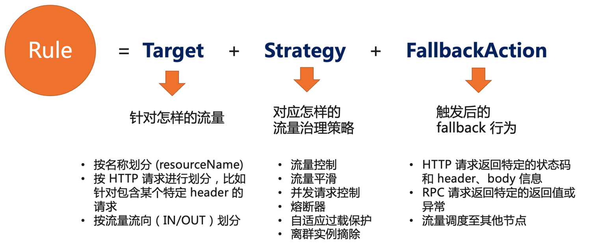

# 流控降级与容错标准 v1alpha1

* domain: fault-tolerance
* version: v1alpha1

流控降级与容错是服务流量治理中关键的一环，以流量为切入点，通过流控、熔断降级、流量平滑、自适应过载保护等手段来保障服务的稳定性。在 OpenSergo 中，我们期望结合 [Sentinel](https://sentinelguard.io/) 等框架组件的场景实践对流控降级与容错抽出标准 CRD。一个容错治理规则 (`FaultToleranceRule`) 由以下三部分组成：

* Target: 针对什么样的请求
* Strategy: 容错或控制策略，如流控、熔断、并发控制、自适应过载保护、离群实例摘除等
* FallbackAction: 触发后的 fallback 行为，如返回某个错误或状态码



## Target

Target 定义该规则针对什么样的请求，如某个 key（可以类比 Sentinel 中的资源名的概念），或者包含某类参数的 HTTP 请求等等。v1alpha1 版本中，Target 先通过 targetResourceName 的方式直接配置资源 key。具体的用法可以参考最后的例子。

在后期版本的标准中，Target 会支持根据 HTTP、gRPC 等流量进行细分。如 HTTP target。

## Strategy

Strategy 定义该规则对应的容错或控制策略。在 v1alpha1 版本中，Strategy 支持流控、匀速排队、并发控制、熔断、系统过载保护等策略。在后续版本中，Strategy 还会支持过载实例摘除/调度、参数流控等能力。

### 流量控制

流量控制策略 (RateLimitStrategy)，即控制单位时长内的请求量在一定范围内。多适用于激增流量下保护服务承载能力在容量之内，避免过多流量将服务打垮。RateLimitStrategy 包含以下要素：

| 字段名 | 是否必填 | 类型 | 描述 |
| -------- | -------- | -------- | -------- |
| metricType     | required     |  string (enum) | 指标类型，取值范围 `RequestAmount`    |
| limitMode     | required     |  string (enum) | 控制模式，单机 `Local`, 集群总体 `Global`, 集群按实例数转单机 `GlobalToLocal`    |
| threshold     | required     |  double | 阈值，单位统计时长内最多允许的量    |
| statDuration     | required     |  string (int+timeUnit) | 统计时长，如 `1s`, `5min`；也可考虑 timeUnit 形式    |

以下示例定义了一个集群流控的策略，集群总体维度每秒不超过 10个请求。示例 CR YAML:

```yaml
apiVersion: fault-tolerance.opensergo.io/v1alpha1
kind: RateLimitStrategy
metadata:
  name: rate-limit-foo
spec:
  metricType: RequestAmount
  limitMode: Global
  threshold: 10
  statDuration: "1s"
```

### 流量平滑

流量平滑策略 (ThrottlingStrategy)，以匀速+排队等待控制效果，对并发请求进行平滑。多适用于异步后台任务（如消息 consumer 批量处理）或对延时不敏感的请求场景。ThrottlingStrategy 包含以下要素：

| 字段名 | 是否必填 | 类型 | 描述 |
| -------- | -------- | -------- | -------- |
| minIntervalOfRequests     | required     |  string (int+timeUnit) | 相邻两个并发请求之间的最短时间间隔    |
| queueTimeout     | required     |  string (int+timeUnit) | 最大排队等待时长   |

以下示例定义了一个匀速排队的策略，相邻两个并发请求的时间间隔不小于 20ms，同时排队平滑的等待时长不超过 500ms。示例 CR YAML:

```yaml
apiVersion: fault-tolerance.opensergo.io/v1alpha1
kind: ThrottlingStrategy
metadata:
  name: throttling-foo
spec:
  minIntervalOfRequests: '20ms'
  queueTimeout: '500ms'
```

### 并发控制

并发控制 (ConcurrencyLimitStrategy)，即控制同时并发调用请求的数目。多适用于慢调用场景下的软隔离保护，避免调用端线程池被某些慢调用占满，导致服务不可用甚至链路不可用。ConcurrencyLimitStrategy 包含以下要素：

| 字段名 | 是否必填 | 类型 | 描述 |
| -------- | -------- | -------- | -------- |
| maxConcurrency     | required     |  int | 最大并发   |
| limitMode     | required     |  string (enum) | 控制模式，单机 `Local`, 集群总体 `Global`    |

示例 CR YAML:

```yaml
apiVersion: fault-tolerance.opensergo.io/v1alpha1
kind: ConcurrencyLimitStrategy
metadata:
  name: concurrency-limit-foo
spec:
  maxConcurrency: 8
  limitMode: 'Local'
```

### 熔断保护

CircuitBreakerStrategy 对应微服务设计中标准的断路器模式，单机维度生效。CircuitBreakerStrategy 包含以下要素：

* strategy: 熔断策略，目前支持 慢调用比例 `SlowRequestRatio`、错误比例 `ErrorRequestRatio`
* triggerRatio: 触发比例
* statDuration: 统计时长，如 `1s`, `5min`；也可考虑 timeUnit 形式
* recoveryTimeout: 进入熔断状态后的等待时长，等待后会进入半开启恢复模式
* minRequestAmount: 单位统计时长内，最小请求数
* slowConditions: 慢调用策略下的条件，若熔断策略为“慢调用比例”则必填
  * maxAllowedRt: 慢调用策略下，超出该响应时长的请求认为是慢调用
* errorConditions: 错误策略下的条件，若熔断策略为“错误比例”则必填
  * errorType: 错误类型
 
以下示例定义了一个慢调用比例熔断策略（在 30s 内请求超过 500ms 的比例达到 60% 时，且请求数达到5个，则会自动触发熔断，熔断恢复时长为 5s），示例 CR YAML:

```yaml
apiVersion: fault-tolerance.opensergo.io/v1alpha1
kind: CircuitBreakerStrategy
metadata:
  name: circuit-breaker-slow-foo
spec:
  strategy: SlowRequestRatio
  triggerRatio: '60%'
  statDuration: '30s'
  recoveryTimeout: '5s'
  minRequestAmount: 5
  slowConditions:
    maxAllowedRt: '500ms'
```
 
### 自适应过载保护

实例维度自适应过载保护策略 (AdaptiveOverloadProtectionStrategy)，基于某些系统指标与自适应策略结合来对实例维度的稳定性进行整体兜底保护。注意该策略的维度为某个服务的每个 pod 维度，分别生效，不区分具体条件。

AdaptiveOverloadProtectionStrategy 包含以下要素：

* metricType: 过载保护针对的指标类型，如 CPU usage percentage, system load, memory 等
* triggerThreshold: 触发值，超出此值则按条件进行限制
* adaptiveStrategy: 自适应策略，若不支持或不开启则填 `NONE`；目前 CPU usage 指标支持 `BBR` 策略

示例 CR YAML:

```yaml
apiVersion: fault-tolerance.opensergo.io/v1alpha1
kind: AdaptiveOverloadProtectionStrategy
metadata:
  name: system-overload-foo
spec:
  metricType: 'CpuPercentage'
  triggerThreshold: '70%'
  adaptiveStrategy: 'BBR
```

## FallbackAction

v1alpha1 版本中，由于 target 先针对泛化的 resourceName，这里先忽略 FallbackAction 这一项。

在后期版本中，再根据 HTTP、gRPC 等流量进行细分。针对 HTTP 请求的 fallbackAction 可以参考下面的示例。

## 容错治理规则示例

一个 YAML 示例：

```yaml
apiVersion: fault-tolerance.opensergo.io/v1alpha1
kind: RateLimitStrategy
metadata:
  name: rate-limit-foo
spec:
  metricType: RequestAmount
  limitMode: Global
  threshold: 10
  statDuration: "1s"
---
apiVersion: fault-tolerance.opensergo.io/v1alpha1
kind: HttpRequestFallbackAction
metadata:
  name: fallback-foo
spec:
  behavior: ReturnProvidedResponse
  behaviorDesc:
    # 触发策略控制后，HTTP 请求返回 429 状态码，同时携带指定的内容和 header.
    responseStatusCode: 429
    responseContentBody: "Blocked by Sentinel"
    responseAdditionalHeaders:
      - key: X-Sentinel-Limit
        value: "foo"
---
apiVersion: fault-tolerance.opensergo.io/v1alpha1
kind: FaultToleranceRule
metadata:
  name: my-rule
  namespace: prod
  labels:
    app: my-app # 规则配置生效的应用名
spec:
  targets:
    - targetResourceName: '/foo'
  strategies: 
    - name: rate-limit-foo
  fallbackAction: fallback-foo
```

这个规则相当于为 key 为 `/foo` 的请求配置了一个策略（以下假定该资源对应 HTTP 请求），这个策略对应流控策略，全局不超过 10 QPS。当策略触发时，被拒绝的请求将根据配置的 fallback 返回 429 状态码，返回信息为 `Blocked by Sentinel`，同时返回 header 中增加一个 header，key 为 `X-Sentinel-Limit`, value 为 foo。

## References

* [Sentinel: OpenSergo 流量治理的标准实现](https://sentinelguard.io/)