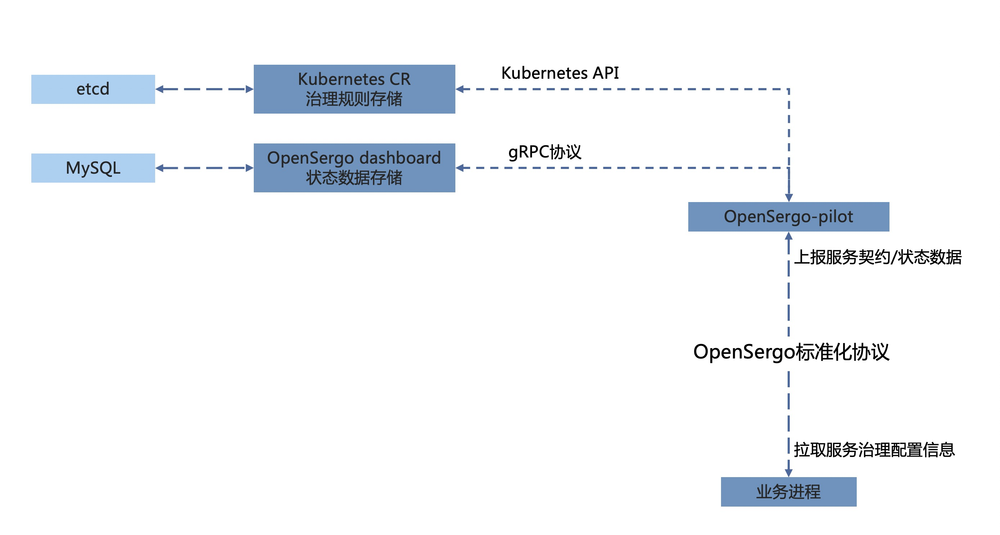

# OpenSergo Spec

OpenSergo 致力于构建一套开放的、语言无关的、贴近业务语义的服务治理规范。

让开发者能够以一种统一的规范来管理不同语言、不同协议的服务。

## 整体架构



## 组件说明

* 治理规则定义

包含了服务治理中基本概念的定义、治理规则的定义。

* [OpenSergo协议](./opensergo-protocol.md)

基于gRPC描述的标准化协议，包含了服务治理中的上报规范、治理规则下发的格式。

* [OpenSergo-pilot](./pilot.md)

负责通过环境变量注入OpenSergo接入信息，接收、转发上报信息、治理规则下发。

* OpenSergo-dashboard

负责接收并存储服务上报信息、展示服务状态、配置服务治理规则。

## 接入方式

对于各个框架，*必须*使用环境变量方式接入服务治理。

有如下两个环境变量：

`OPENSERGO_BOOTSTRAP_CONFIG`
为 JSON 格式的服务治理配置内容，比如：

```json
{
  "endpoint":"opensergo-pilot.opensergo-pilot.svc.cluster.local:50051"
}
```

`OPENSERGO_BOOTSTRAP`
内容为配置文件路径，路径的内容是JSON格式的服务治理配置。

对于RPC框架，如果上述两个环境变量任意一个存在，则开启服务治理功能。
