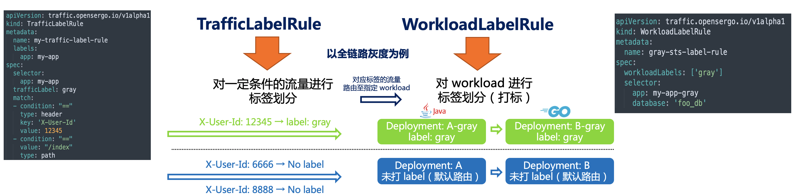

# 流量路由标准 v1alpha1

* domain: traffic
* version: v1alpha1

流量路由，顾名思义就是将具有某些属性特征的流量，路由到指定的目标。流量路由是流量治理中重要的一环，多个路由如同流水线一样，形成一条路由链，从所有的地址表中筛选出最终目的地址集合，再通过负载均衡策略选择访问的地址。开发者可以基于流量路由标准来实现各种场景，如灰度发布、金丝雀发布、容灾路由、标签路由等。

流量路由规则 (v1alpha1) 主要分为三部分：

- Workload 集合的抽象 (`VirtualWorkloads`)：将某一组 `VirtualWorkload`（如 Kubernetes Deployment, Statefulset 或者一组 pod，或某个 JVM 进程，甚至是一组 DB 实例）按照一定的特征进行分类。
- 流量标签规则 (`RouterRule`)：将特定特征的流量映射至特定特征所对应的 VirtualWorkloads 上。
- 路由链规则(`RouterChain`)将特定的 `RouterRule` 跟 `VirtualWorkloads`按照一定逻辑排列组合成 pipeline。

# 设计原则与思想

- 从常见路由场景以及最佳实践出发，能够被多语言解析实现、能够覆盖流量路由涉及到的各个组件。
- 流量路由规则只定义流量路由相关的配置，并且覆盖流量路由相关的各种通用场景。
- 在保证业务正确性的前提下，尽可能保证流量路由可以选择到有效的虚拟工作负载。

# 概念介绍

其中常用路由的格式如下:

TrafficRule = RouterRule + VirtualWorkloads

RouterChain = F(TrafficRule...)

## Workload 集合的抽象 (`VirtualWorkloads`)

`VirtualWorkloads` 虚拟工作负载集合的抽象即 VirtualWorkload 集合，其中会将 VirtualWorkload 按照一定的特征进行分类。

`VirtualWorkload`虚拟工作负载即 workload 集合的抽象，将一定属性特征的 workload 集合划分成一个 VirtualWorkload，其中 VirtualWorkload 
可以是目标 service 集合也可以是 deployment，甚至可以是 database 的实例、库、表集合。

对于通用的 workload 场景，我们可以利用 VirtualWorkloads CRD 进行描述。特别地，对于 Kubernetes workload，我们可以通过直接在 workload 上
打 label 的方式进行特征标记，如在 Deployment 上打上 `traffic.opensergo.io/label: gray` 标签代表当前 Deployment 的标签特征为 gray。

一个标准的 workloads 描述应该类似于:

```yaml
apiVersion: traffic.opensergo.io/v1alpha1
kind: VirtualWorkloads
metadata:
  name: tag-rule
spec:
  selector:
    app: my-app
  virtualWorkload:
    - name: my-app-gray
      target: my-app-gray-deployment    
      type: deployment
      selector:
        tag: gray
```

## 流量路由规则 (`RouterRule`)

流量路由规则 (`RouterRule`) 将特定特征的流量映射至特定特征所对应的 VirtualWorkloads 上。

假设现在需要将内部测试用户灰度到新版主页，测试用户 uid=12345，UID 位于 X-User-Id header 中，不符合条件的外部用户流量访问原版主页。那么只需要
配置如下 CRD 即可：

```yaml
apiVersion: traffic.opensergo.io/v1alpha1
kind: RouterRule
metadata:
  name: tag-traffic-router-rule
spec:
  selector:
    app: my-app
  http: 
    - name: my-traffic-router-http-rule
      rule:  
        match:
          header: 
            X-User-Id:   # 参数名
              exact: 12345       # 参数值
          uri:
            exact: "/index"
        targets:
          - workloads: my-app-worksloads
            name: gray
      target:
        workloads: my-app-worksloads
        name: base
```

通过上述配置，我们可以将 path 为 `/index`，且 uid header 为 12345 的 HTTP 流量为灰度流量，访问灰度版本的新版主页。

## 路由链(`RouterChain`)

TrafficRule = RouterRule + VirtualWorkloads

RouterChain = F(TrafficRule...)

`RouterChain` 路由链，将具备不同路由功能的多个Router按照一定的顺序进行组合，形成一条链式的路由拓扑，路由链的组合模式有以下两种，可以根据自己的
需求进行组合。

- 串联的 Router，串联路由匹配结果将采取 VirtualWorkload 交集


- 并联的 Router，并联路由匹配结果将采取 VirtualWorkload 并集


我们看到上面的图，在路由的过程当中，我们是 Pipeline 的处理方式，Pipeline 的 Router 节点存在顺序，并且每个 Router 都有一个唯一对应
的 RouterRule 和相应的 VirtualWorkloads 进行描述。

### RouteChain 的组装

通过一个CRD描述Router组合的情况。

TBD...

## 路由场景

### 标签路由

假设我们创建了以下的标签路由的规则 

我们希望 Header x-user-id为123的流量访问 spring-cloud-a 的具备 gray 标签的实例。

其中spring-cloud-a的标签情况如下：


#### OpenSergo 流量路由配置

- 对应的 RouterRule 配置

```yaml
apiVersion: traffic.opensergo.io/v1alpha1
kind: RouterRule
metadata:
  name: tag-traffic-router-rule
spec:
  selector:
    app: spring-cloud-a
  http: 
    - name: my-traffic-router-http-rule
      rule:  
        match:
          headers: 
            X-User-Id:   # 参数名
              regex: "^(?!(?:\d{1,2}|100)$)[0-9]\d+$"       # 参数值
          queryParams:
            name:
              exact: xiaoming
          uri:
            prefix: "/"
        targets:
          - workloads: spring-cloud-a-worksloads
            name: gray
      target:
        - workloads: spring-cloud-a-worksloads
          name: base
```

- 对应的 VirtualWorkloads 配置

```yaml
apiVersion: traffic.opensergo.io/v1alpha1
kind: VirtualWorkloads
metadata:
  name: spring-cloud-a-worksloads
spec:
  selector:
    app: spring-cloud-a
  virtualWorkload:
    - name: gray
      target: spring-cloud-a
      type: deployment
      selector:
        tag: gray
      loadbalance: random
    - name: base
      target: spring-cloud-a
      type: deployment
      selector:
        tag: _base
      loadbalance: random
```

### 金丝雀发布

我们配置了如下的金丝雀规则，希望 10% 的流量访问spring-cloud-a中具有 gray 标签的实例


#### OpenSergo 流量路由配置

- 对应的 RouterRule 配置

```yaml
apiVersion: traffic.opensergo.io/v1alpha1
kind: RouterRule
metadata:
  name: tag-traffic-router-rule
spec:
  selector:
    app: spring-cloud-a
  http: 
    - name: my-traffic-router-http-rule
      rule:
        targets:
          - workloads: spring-cloud-a-worksloads
            name: gray
            weight: 10
          - workloads: spring-cloud-a-worksloads
            name: base
            weight: 90
      target:
        - workloads: spring-cloud-a-worksloads
          name: base
```

### 全链路灰度



# 流量路由规范明细

## RouterRule

路由规则主要是将特定特征的流量映射至特定特征所对应的 VirtualWorkloads 上。

该 spec 针对的流量匹配模型需要考虑常见协议的支持。

| Field | Type | Description | Required |
| --- | --- | --- | --- |
| selector | map<string,StringMatch> | 选择器，用于选择生效的主体 | Yes |
| http | HttpRouterRule[] | Http 流量路由规则列表 | No |
| rpc | RpcRouterRule[] | Rpc 流量路由规则列表 | No |
| redis | RedisRouterRule[] | Redis 流量路由规则列表 | No |
| db | DatabaseRouterRule[] | Database 流量路由规则列表 | No |

- 示例

```yaml
apiVersion: traffic.opensergo.io/v1alpha1

kind: RouterRule
metadata:
  name: tag-traffic-router-rule
spec:
  selector:
    app: spring-cloud-a
  http: 
    - name: my-traffic-router-http-rule
      rule:  
        match:
          header: 
            X-User-Id:   # 参数名
              exact: 123       # 参数值
          uri:
            prefix: "/"
        targets:
          - workloads: spring-cloud-a-worksloads
            name: gray
      target:
        workloads: spring-cloud-a-worksloads
        name: base
  rpc:
    - name: my-traffic-router-rpc-rule
      rule:
        match:
          services:
            - prefix: "io.opensergo.traffic.demo"
          methods:
            - methodName: sayHello
             args: 
              - index: 0
                value:
                  exact: xiaoming
              - index: 1
                type:
                  exact: "io.opensergo.traffic.demo.Student"
        targets:
          - workloads: spring-cloud-a-worksloads
            name: gray
      target:
        - workloads: spring-cloud-a-worksloads
          name: base
```

## HttpRouteRule

- Http流量路由规则

流量先是按照 rule 流量路由规则匹配，如果匹配成功，直接返回对应的 VirtualWorkload；如果匹配失败，则流量默认访问 target 指定
的 VirtualWorkload；如果无配置 target 或者 target 中的 VirtualWorkload 内容为空，则进行 fallback 的行为。

| Field | Type | Description | Required |
| --- | --- | --- | --- |
| name | string | 规则的名字 |  |
| rule | HttpRouteRuleContext | 具体的流量规则，顺序执行，符合条件立即返回，优先级高于 target 匹配 | Yes |
| target | VirtualWorkload | 默认的虚拟工作负载 | No |
| fallback | HttpRouteFallback | 路由匹配失败的Fallback行为处理的配置 | No |

- 示例

```yaml
apiVersion: traffic.opensergo.io/v1alpha1
kind: RouterRule
metadata:
  name: my-traffic-router-rule
spec:
  selector:
    app: provider-app
  http: # http/rpc/db/redis
    - name: my-traffic-router-http-rule
      rule:
        match:
          headers: 
            - X-User-Id:   # 参数名
              exact: 12345       # 参数值
          uri:
            exact: "/index"
        targets:
          - workloads: tag-rule
            name: my-app-gray
      target:
        workloads: tag-rule
        name: my-app-base
```
## HttpRouteRuleContext

Http流量路由规则内容，其中包含流量匹配规则、匹配上的流量所映射的 VirtualWorkload 以及匹配上的流量所需进行流量修改的规则。

| name | string |  | No |
| --- | --- | --- | --- |
| match | HttpRequestMatch | Http流量的匹配规则 | No |
| targets | VirtualWorkload[] | 匹配到Http流量的匹配规则的目标虚拟工作负载集合 | Yes |
| modify | HttpModifyRule | 对匹配到Http流量匹配规则的流量进行修改的规则 | No |

## HttpRouteFallback

Http流量路由匹配失败 Fallback 行为处理的配置

TBD...

## HttpRequestMatch

Http流量的匹配规则：

| Field | Type | Description | Required |
| --- | --- | --- | --- |
| name | string | 匹配规则的名称 | No |
| uri | StringMatch | 按照http请求的uri进行匹配 | No |
| method | StringMatch | 按照http请求的method进行匹配 | No |
| headers | map<string, StringMatch> | 按照http请求的headers进行匹配 | No |
| queryParams | map<string, StringMatch> | 按照http请求的请求参数进行匹配 | No |
| ignoreUriCase | bool | 匹配uri时是否忽略大小写 | No |
| sourceLabels | map<string, StringMatch> | 根据调用端调用时打的相关 labels 进行匹配，labels 可以包含应用名、工作负载环境变量信息等。对于JAVA中的 Spring Cloud 而言，可以从上报的 URL 拿到对应的 key/value。 | No |

## HttpModifyRule

对匹配到Http流量匹配规则的流量进行修改的规则配置

TBD...

## RpcRouteRule

Rpc 流量路由规则：流量先是按照 rule 流量路由规则匹配，如果匹配成功，直接返回对应的 VirtualWorkload；如果匹配失败，则流量默认访问 target 指定
的 VirtualWorkload；如果无配置 target 或者 target 中的VirtualWorkload 内容为空，则进行 fallback 的行为。

| Field | Type | Description | Required |
| --- | --- | --- | --- |
| name | string | 规则的名字 | No |
| rule | RpcRouteRuleContext | 具体的流量规则，顺序执行，符合条件立即返回，优先级高于 target 匹配 | Yes |
| target | VirtualWorkload | 默认的虚拟工作负载 | No |
| fallback | RpcRouteFallback | 路由匹配失败的Fallback行为处理的配置 | No |

## RpcRouteRuleContext

Rpc 流量路由规则内容，其中包含流量匹配规则、匹配上的流量所映射的 VirtualWorkload 以及匹配上的流量所需进行流量修改的规则。

| Field | Type | Description | Required |
| --- | --- | --- | --- |
| name | string | 名称 | No |
| match | RpcRequestMatch | Rpc流量的匹配规则 | No |
| targets | VirtualWorkload[] | 匹配到Rpc流量的匹配规则的目标虚拟工作负载集合 | Yes |

## RpcRequestMatch

Rpc 流量的匹配规则：

| Field | Type | Description | Required |
| --- | --- | --- | --- |
| name | string | Rpc请求匹配规则名称 | No |
| services | StringMatch[] | 服务列表，可使用具体的服务名，也可以使用正则 * 的方式进行匹配；默认不配置，则代表所有的服务都生效 | No |
| methods | RpcMethodMatch[] | 方法相关的匹配 | No |
| attachments | map<string, StringMatch> | 请求附带的其他信息，比如 TraceId 等信息 | No |
| sourceLabels | map<string, StringMatch> | 根据调用端调用时打的相关 labels 进行匹配,  labels 可以包含应用名、工作负载环境变量信息等。对于JAVA中的 Dubbo 而言，可以从上报的 URL 拿到对应的 key/value | No |
| headers | map<string, StringMatch> | 按照 Rpc 请求的headers进行匹配 | No |

## RpcMethodMatch

Rpc 流量按照方法维度进行流量匹配的规则：

| Field | Type | Description | Required |
| --- | --- | --- | --- |
| service | StringMatch | 方法所属的服务 | No |
| methodName | StringMatch | 匹配请求中的调用方法名 | No |
| args | RpcMethodArgsMatch[] | 为 DubboMethodArg 类型的数组，表示每个参数值需要满足的条件 | No |

## RpcMethodArgsMatch

Rpc 流量按照方法参数维度进行流量匹配的规则：

| Field | Type | Description | Required |
| --- | --- | --- | --- |
| index | string | 方法参数下标 | Yes |
| type | StringMatch | 参数类型 | No |
| value | StringMatch | 参数值 | No |

## VirtualWorkloads

VirtualWorkload集合，按照VirtualWorkload的特征进行分类。

一个标准的  VirtualWorkloads  应该类似于:

```yaml
apiVersion: traffic.opensergo.io/v1alpha1
kind: VirtualWorkloads
metadata:
  name: tag-rule
spec:
  selector:
    app: my-app
    database: 'foo_db'
  virtualWorkload:
    - name: my-app-gray
      target: my-app-gray-deployment    
      type: deployment
      selector:
        tag: gray
      loadbalance: random
    - name: my-app-blue
      target: my-app-blue-deployment    
      type: deployment
      selector:
        tag: blue
      loadbalance: random
    - name: my-app-base
      target: my-app-deployment  
      type: deployment
      selector:
        tag: _base
      loadbalance: random
```

| Field | Type | Description | Required |
| --- | --- | --- | --- |
| name | string | 虚拟工作负载集合的名称 | Yes |
| selector | map<string,string> | 按照一定特选出对应的虚拟工作负载的集合 | Yes |
| virtualWorkload | VirtualWorkload[] | 虚拟工作负载集合 | Yes |

## VirtualWorkload

workload集合的抽象，将一定属性特征的 workload 集合划分成一个 VirtualWorkload，其中 VirtualWorkload 可以是目标service集合也可以是
deployment，甚至可以是database的实例、库、表集合。

| Field | Type | Description | Required |
| --- | --- | --- | --- |
| name | string | 虚拟工作负载名称 | Yes |
| workloads | string | 虚拟工作负载集合名称 | No |
| target | string | 真实的工作负载对象 | Yes |
| type | string | 真实的工作负载类型 | Yes |
| selector | map<string,string> | 按照一定特征进行将虚拟工作负载进行划分 | Yes |
| loadbalance | string | 虚拟工作负载内的负载均衡方式 | No |
| weight | string | 当前虚拟工作负载流量路由的权重 | No |

## StringMatch

按照一定的字符串规则进行匹配。

| Field | Type | Description | Required |
| --- | --- | --- | --- |
| exact | string (oneof) | 字符匹配 | No |
| prefix | string (oneof) | 前缀匹配 | No |
| regex | string (oneof) | 正则匹配 | No |
| vars | string (oneof) | 预留（自定义脚本规则解析） | No |
